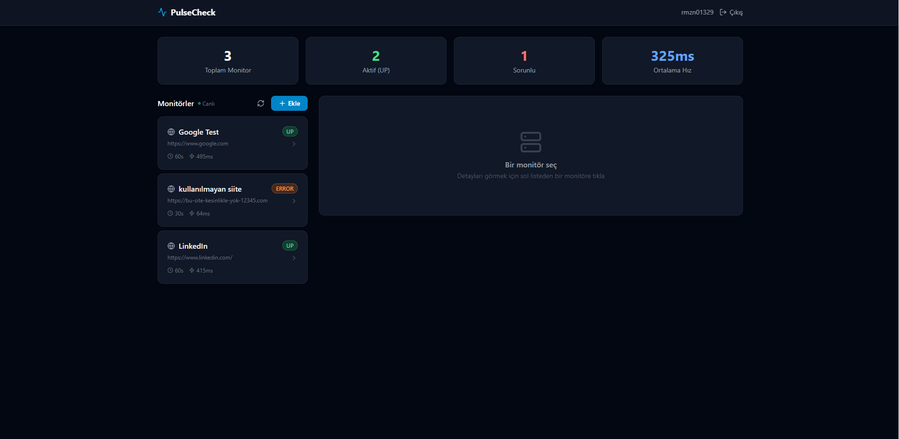
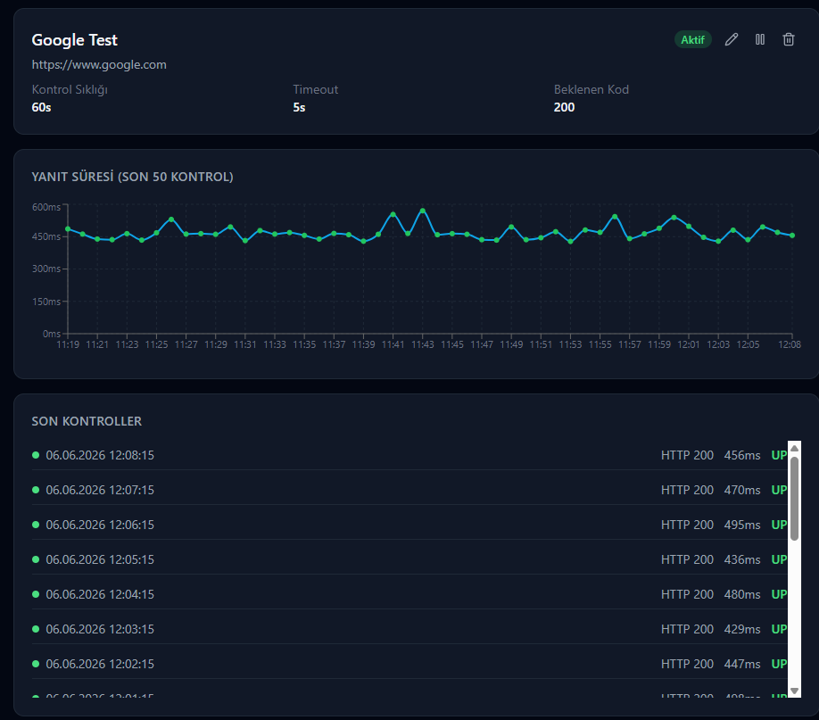
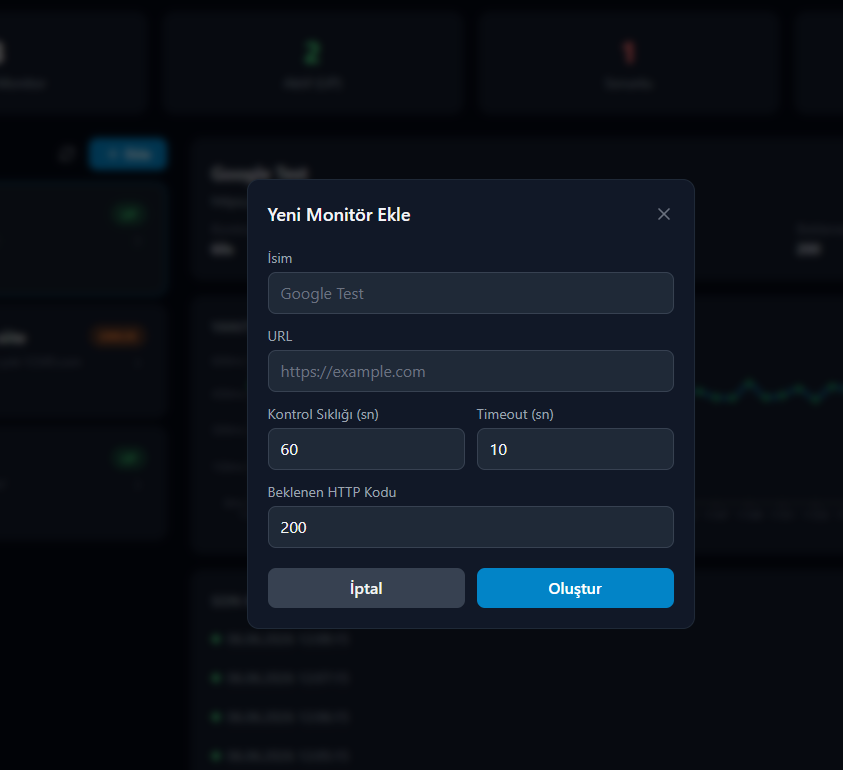

# 🟢 PulseCheck

🇹🇷 [Türkçe dokümantasyon için tıklayın (Turkish)](README-tr.md)

> **Real-time uptime monitoring — built for reliability, designed for developers.**

PulseCheck is a full-stack SaaS-grade uptime monitoring system. It periodically pings your HTTP endpoints via a persistent Quartz scheduler, logs every check result, and presents live status data through a modern dark-mode dashboard. Monitors survive server restarts, ownership is enforced at the API level, and the entire surface is secured with stateless JWT authentication.

---

## 📸 UI Showcase


| Dashboard Overview | Monitor Detail & Chart | Empty State |
|---|---|---|
|  |  |  |

---

## ✨ Key Features

- 🔁 **Dynamic Scheduling** — Each monitor runs on its own Quartz trigger. Interval, timeout, and expected status code are configurable per monitor and take effect immediately on update.
- 📋 **Per-Check Log History** — Every ping result (status, HTTP code, response time, error message) is persisted to PostgreSQL and served via a paginated API.
- 📊 **Live Response-Time Chart** — Recharts line graph visualises the last 50 check results with colour-coded dots (UP / DOWN / TIMEOUT / ERROR).
- 🔒 **JWT Authentication** — Stateless token-based auth with Spring Security. Access tokens are injected by an Axios request interceptor; 401 responses auto-redirect to login.
- 🔄 **Crash Recovery** — `ApplicationRunner` re-schedules all enabled monitors on startup so no heartbeat is missed after a restart or redeploy.
- 🛡️ **Security by Obscurity** — Ownership-check endpoints return `404 Not Found` instead of `403 Forbidden` to prevent information leakage about other users' resources.
- 📄 **Paginated Responses** — All list endpoints use Spring Data `Pageable` with server-side sort enforcement, compatible with Swagger UI's default parameters.
- 🌑 **Dark-Mode Dashboard** — TailwindCSS utility-first UI with live pulse indicator, stat cards (total / UP / DOWN / avg response time), and inline edit/delete/pause actions.
- 📖 **Swagger UI** — Every endpoint is documented and testable at `/api/swagger-ui/index.html` with no extra tooling.

---

## 🛠️ Tech Stack

### Frontend

| Technology | Role |
|---|---|
| **React 18** + **TypeScript** | Component framework & type safety |
| **Vite** | Dev server & production bundler |
| **TailwindCSS** | Utility-first styling & dark theme |
| **Recharts** | Response-time line chart |
| **Axios** | HTTP client with JWT interceptor |
| **React Router v6** | Client-side routing & protected routes |
| **Lucide React** | Icon library |

### Backend

| Technology | Role |
|---|---|
| **Spring Boot 3.2** | Application framework |
| **Spring Security 6** | JWT filter chain, method-level auth |
| **Quartz Scheduler** | Persistent, per-monitor cron jobs |
| **Spring Data JPA** + **Hibernate** | ORM, optimistic locking via `@Version` |
| **PostgreSQL 16** (TimescaleDB) | Primary datastore |
| **Flyway** | Schema versioning & migrations |
| **MapStruct** | Compile-time entity ↔ DTO mapping |
| **Springdoc OpenAPI** | Auto-generated Swagger docs |
| **Lombok** | Boilerplate reduction |
| **Docker Compose** | Local Postgres + Redis services |

---

## 🏗️ Architecture Highlights

These are the design decisions that go beyond a typical CRUD application.

### 1 · Quartz Scheduler — Dynamic, Per-Monitor Jobs

Most monitoring tools run a single cron that scans all enabled rows. PulseCheck takes a different approach: **each monitor owns a dedicated Quartz `JobDetail` and `SimpleTrigger`**.

```
POST /monitors  →  MonitorService.createMonitor()
                       └─ MonitorSchedulerService.scheduleMonitor()
                               └─ scheduler.scheduleJob(jobDetail, trigger)
                                       └─ fires MonitorCheckJob every N seconds
```

When a monitor is updated (new interval, new URL, toggled enabled), the old trigger is **deleted and rescheduled atomically**. Disabling a monitor calls `scheduler.deleteJob()` — the heartbeat stops immediately, not on the next scan cycle.

`MonitorCheckJob` is a plain Quartz `Job` (not a Spring bean), yet uses `@Autowired` repositories — enabled by `AutowiringSpringBeanJobFactory` in `QuartzConfig`, which calls `beanFactory.autowireBean(job)` before execution.

---

### 2 · `ApplicationRunner` — Crash-Resilient Scheduling

Quartz's `RAMJobStore` (used in the local/dev profile) is in-memory and does not survive a JVM restart. `MonitorStartupRunner` bridges this gap:

```java
@Component
public class MonitorStartupRunner implements ApplicationRunner {
    public void run(ApplicationArguments args) {
        monitorRepository.findByEnabled(true)
            .forEach(schedulerService::scheduleMonitor);
    }
}
```

On every startup, all previously enabled monitors are re-inserted into the scheduler. **Zero manual intervention is needed after a crash or redeploy.**

> In a production deployment this would be replaced with Quartz's JDBC `JobStoreTX` (cluster-safe, survives restarts natively). The `ApplicationRunner` pattern serves as an explicit, auditable alternative for single-node deployments.

---

### 3 · 404 Instead of 403 — Preventing Information Leakage

A naive implementation would return `403 Forbidden` when a user requests logs for a monitor they don't own. This leaks the information that the resource *exists* — useful to an attacker enumerating UUIDs.

`CheckLogService` applies the **security-through-obscurity** pattern:

```java
Monitor monitor = monitorRepository.findById(monitorId)
    .orElseThrow(() -> new ResourceNotFoundException("Monitor not found"));

if (!monitor.getUser().getId().equals(currentUserId)) {
    // Don't reveal existence — respond identically to "not found"
    throw new ResourceNotFoundException("Monitor not found");
}
```

Both the "doesn't exist" and "exists but belongs to someone else" cases surface as `404`. An attacker learns nothing from either response.

---

### 4 · Forced Server-Side Sort (Swagger-Safe Pagination)

Swagger UI injects `?sort=string` as a default `Pageable` parameter. Spring Data JPA naively appends this to the JPQL `ORDER BY` clause, producing `ORDER BY cl.string asc` — an unmapped field that throws `UnknownPathException`.

The fix removes the `ORDER BY` clause from the repository `@Query` entirely and enforces sort in the service layer:

```java
// CheckLogService.java
Pageable sorted = PageRequest.of(
    pageable.getPageNumber(),
    pageable.getPageSize(),
    Sort.by(Sort.Direction.DESC, "checkedAt")   // always wins
);
return checkLogRepository.findByMonitorIdPaged(monitorId, sorted);
```

Client-supplied sort is silently overridden. The endpoint behaves correctly from both Swagger UI and production callers.

---

## 📖 API Documentation

Swagger UI is bundled and enabled in all profiles.

```
http://localhost:8080/api/swagger-ui/index.html
```

All endpoints require a `Bearer <token>` header except `POST /api/api/auth/login` and `POST /api/api/auth/register`. Use the **Authorize** button in Swagger UI to set your token globally.

---

## 🚀 Getting Started

### Prerequisites

| Tool | Version |
|---|---|
| Java | 17+ |
| Maven | 3.9+ |
| Node.js | 18+ |
| Docker | 24+ (for local Postgres) |

---

### 1 · Start the Database

```bash
docker-compose up -d postgres
```

This starts a TimescaleDB (PostgreSQL 16) container on **port 5433** with:
- Database: `pulsecheck`
- User: `pulsecheck`
- Password: `pulsecheck123`

---

### 2 · Configure the Backend

Create `backend/.env` (gitignored):

```env
JWT_SECRET=your-super-secret-key-must-be-at-least-256-bits-long
DATABASE_URL=jdbc:postgresql://localhost:5433/pulsecheck
DATABASE_USERNAME=pulsecheck
DATABASE_PASSWORD=pulsecheck123
```

> If `.env` is absent, the `local` Spring profile falls back to safe development defaults defined in `application.yml`. Production deployments should always supply `JWT_SECRET` via environment variable.

---

### 3 · Run the Backend

```bash
cd backend
mvn spring-boot:run
```

Flyway will auto-apply all migrations (`V1__`, `V2__`, …) on first startup. The server listens on **`http://localhost:8080`** with context path `/api`.

---

### 4 · Run the Frontend

```bash
cd frontend
npm install
npm run dev
```

The Vite dev server starts on **`http://localhost:5173`**. The `/api` proxy is configured in `vite.config.ts` to forward all API calls to `http://localhost:8080`.

---

### 5 · First Login

1. Open `http://localhost:5173/register` and create an account.
2. Log in at `http://localhost:5173/login`.
3. Add your first monitor from the Dashboard.

---

## 📁 Project Structure

```
PulseCheck/
├── backend/
│   ├── src/main/java/com/pulsecheck/
│   │   ├── auth/               # Registration, login, JWT, User entity
│   │   ├── monitor/            # Monitor CRUD, Quartz jobs, CheckLog API
│   │   │   ├── controller/
│   │   │   ├── service/        # MonitorService, CheckLogService, MonitorSchedulerService
│   │   │   ├── job/            # MonitorCheckJob (Quartz)
│   │   │   └── entity/         # Monitor, CheckLog
│   │   └── common/             # BaseEntity, SecurityConfig, GlobalExceptionHandler
│   └── src/main/resources/
│       ├── application.yml
│       └── db/migration/       # Flyway SQL migrations
├── frontend/
│   ├── src/
│   │   ├── pages/              # Dashboard, Login, Register
│   │   ├── components/         # Navbar, MonitorCard, UptimeChart
│   │   ├── context/            # AuthContext (JWT management)
│   │   └── services/           # api.ts (Axios instance + interceptors)
│   └── vite.config.ts
└── docker-compose.yml
```

---

## 🔐 Security Notes

- JWT secrets are **never** committed. Use `.env` locally; inject via environment in CI/CD.
- Passwords are hashed with **BCrypt** before persistence.
- The `User.password` and `User.authorities` fields are annotated `@JsonIgnore` — they are **never serialised** in any API response.
- All monitor and log endpoints resolve the authenticated user from the JWT principal; direct ID manipulation is rejected at the service layer.

---

## 📄 License

MIT — free to use, modify, and distribute.

---

<p align="center">
  Built with ☕ Spring Boot &amp; ⚛️ React &nbsp;·&nbsp; PulseCheck © 2026
</p>
